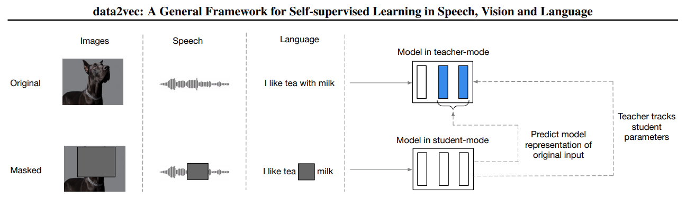

# data2vec-pytorch [In Progress]
##### PyTorch implementation of "[data2vec: A General Framework for Self-supervised Learning in Speech, Vision and Language](https://arxiv.org/abs/2202.03555)" By Meta AI (FAIR)
Data2Vec is the first high-performance self-supervised algorithm that learns the same way in multiple modalities, including speech, vision and text. 
Most machines learn exclusively from labeled data. However, through self-supervised learning, machines are able to learn about the world just by observing it 
and then figuring out the structure of images, speech or text. This is a more scalable and efficient approach for machines to tackle new complex tasks,
such as understanding text for more spoken languages. 

In summary, the method is as follows:  
1. The encoder extracts features from the masked inputs. These features are outputs of every transformer/linear layer.
2. The teacher which is an EMA instance of the encoder (in eval model), extracts features from the unmasked inputs.
3. Optional normalizations are applied to the layers/outputs of the teacher.
4. Encoder outputs are regressed by a projection block/layer.
5. The loss is calculated from encoder outputs and teacher outputs.

You can read the paper for more detail.

### Implementation
Data2Vec is already implemented in [fairseq](https://github.com/pytorch/fairseq/tree/main/examples/data2vec) in which for all modalities there is a seperate implementation (text, vision, audio). According to the paper:
> <cite>Our primary is to design a single learning mechanism for different modalities. 
Despite the unified learning regime, we still use modality-specific features extractors and masking strategies. 
This makes sense given the vastly different nature of the input data.</cite>

This implementation differs in the fact that a single Data2Vec model is provided powered by a custom encoder (implemented using PyTorch + HuggingFace Transformers) and tries to unify the whole concept in a single module. 
The key concept is that there must be modality-specific feature extractions and masking strategies.
The `Data2Vec` model takes in an encoder which has to implement these two:
1. `extract_features`: output of the transformer/projection layers stacked in a list
2. `apply_mask`: masking strategy to mask inputs/features

The encoder models (under `models` directory) are wrappers around HuggingFace Transformers models, but it's possible to use your own encoders 
and provide the latter methods in them. Just make sure that your encoders must be Transformer-based according to the paper and outputs from every encoder layer must be provided.

### Train
TODO

### Evaluation
TODO

### Contributions
This project needs a lot of work. If you can help me out with this just let me know! Thanx.
